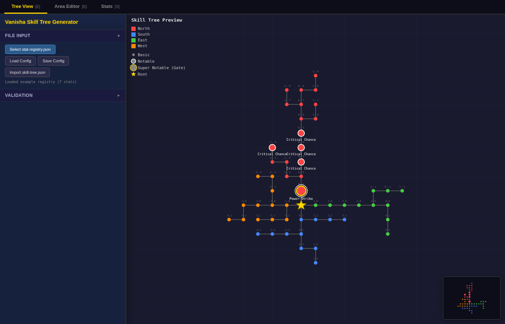

# Vanisha Skill Tree Generator

Browser-based skill tree editor with JSON import/export.



## Running

Static HTML, CSS, and JavaScript. Serve the folder over HTTP:

```bash
git clone <your-fork-url>
cd vanisha-skill-tree-generator
python3 -m http.server 8000
```

Open `http://localhost:8000` in a browser.

The page loads `stat-registry.json` via `fetch()`, which browsers block on `file://` origins. Opening `index.html` directly works if you load the registry through the file picker.

## Features

- Four cardinal paths (north, south, east, west) from a root node
- Node tiers: `basic`, `notable`, `super_notable` (gate)
- Drag-and-drop stat assignment to areas
- Per-area gate slots with prerequisite chaining
- Seeded layout generation
- Manhattan-grid layout with collision avoidance
- JSON import/export
- Autosave to `localStorage`
- "Not Applicable" pool for excluding stats

## Input: stat-registry.json

```json
{
  "stats": [
    {
      "stat": "health",
      "display_name": "Health",
      "description": "Increases maximum health",
      "node_tier": "basic",
      "apply_mode": "add",
      "value_per_node": { "basic": 10, "notable": 25 },
      "display": { "format": "0", "prefix": "+" }
    },
    {
      "stat": "power_strike",
      "display_name": "Power Strike",
      "description": "Unlocks a powerful melee attack",
      "node_tier": "super_notable"
    }
  ]
}
```

| Field | Required | Description |
|---|---|---|
| `stat` | yes | Unique ID. snake_case recommended |
| `display_name` | yes | UI label |
| `description` | yes | Tooltip and export description |
| `node_tier` | yes | `basic`, `notable`, or `super_notable`. `super_notable` is a gate |
| `apply_mode` | no | `add` (default) or `subtract`. Controls sign in the Stats tab |
| `value_per_node` | no | Per-tier increment for Stats tab totals. Required for non-gate stats if you want totals |
| `display` | no | Stats tab formatting. `format` uses C# number patterns (`0`, `0.#`, `0.##`). `multiplier`, `prefix`, `suffix` optional |

## Output: skill-tree.json

```json
{
  "nodes": [
    { "id": "root", "levels": 1, "x": 0, "y": 0, "isRoot": true },
    { "id": "n_2", "levels": 1, "x": 0, "y": -1, "stat": "health", "name": "Health", "description": "Increases maximum health", "path": "north", "area": 1 }
  ],
  "connections": [
    { "from": { "x": 0, "y": 0 }, "to": { "x": 0, "y": -1 } }
  ]
}
```

Empty fields are omitted. Gate nodes have `isSuperNotable: true`. Nodes after a gate in the same area get `gated_by` set to the gate's stat ID.

## Custom stats

Replace `stat-registry.json` with your own file using the same shape, or load it through the file picker.

## License

MIT. See [LICENSE](LICENSE).
